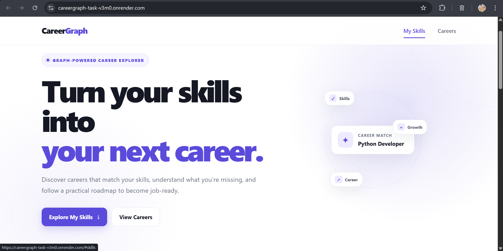
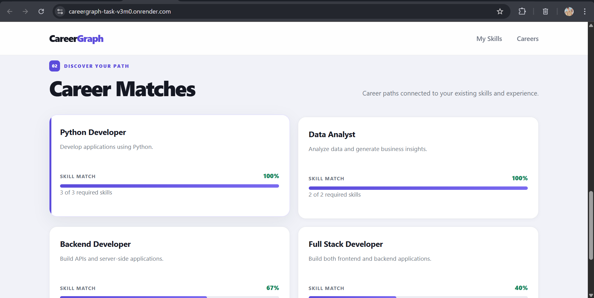
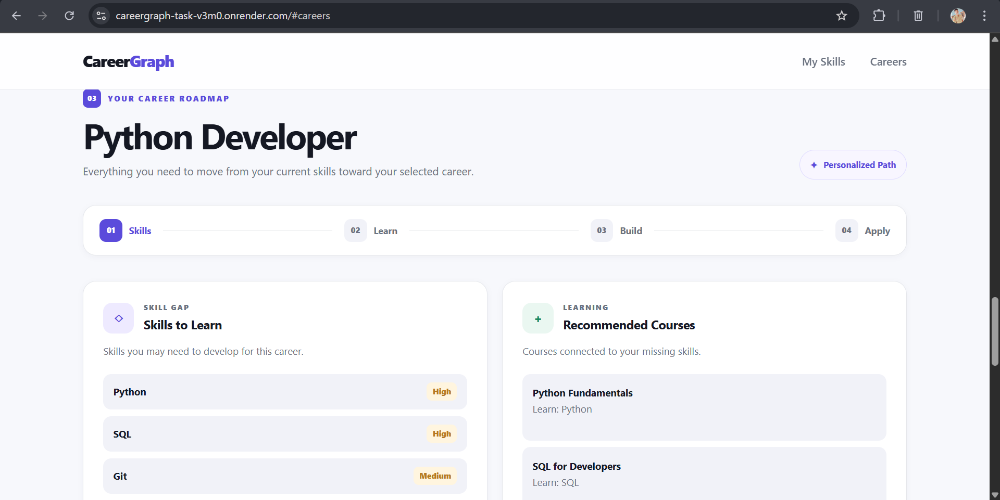
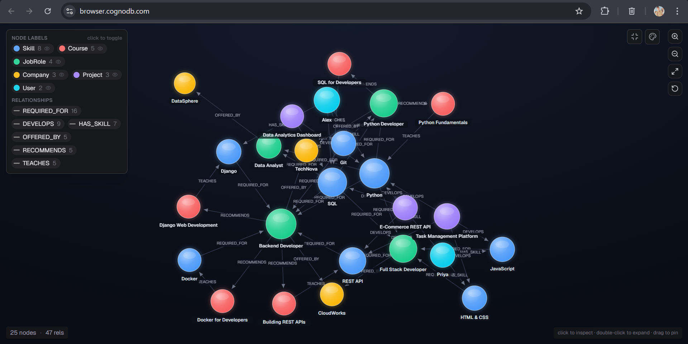

#  CareerGraph

<p align="center">
  <strong>Graph-Powered Career Exploration & Skill Recommendation Platform</strong>
</p>

<p align="center">
  Discover suitable careers from your skills, identify skill gaps, and find courses, companies, and projects to grow.
</p>

<p align="center">
  <a href="https://careergraph-task-v3m0.onrender.com">
    
  </a>
  <a href="https://github.com/shannu1653/careergraph_task">
    
  </a>
</p>

<p align="center">
  
  
  
  
  
</p>

---

## 📌 Overview

**CareerGraph** is a graph-based career recommendation application built with **Flask and CognoDB**.

It connects a user's skills with suitable career roles and provides:

* 🎯 Career matches
* 🧩 Missing skills
* 📚 Recommended courses
* 🏢 Related companies
* 💻 Practical projects

---

## 💡 Why a Graph Database?

Career recommendations depend on relationships between **skills, careers, courses, companies, and projects**.

A graph database makes these relationships easy to model and traverse, especially for multi-hop recommendations.

```text
User
 │
 └── HAS_SKILL ──► Skill
                    │
                    └── REQUIRED_FOR ──► Job Role
                                           │
                              ┌────────────┼────────────┐
                              ▼            ▼            ▼
                           Course       Company      Project
```

This allows CareerGraph to answer questions such as:

> **"Which career fits my skills, what skills am I missing, and what should I learn or build next?"**

---

## ✨ Features

| Feature             | Description                            |
| ------------------- | -------------------------------------- |
| 🎯 Career Matching  | Finds careers based on user skills     |
| 📊 Match Percentage | Shows career match strength            |
| 🧩 Skill Gap        | Identifies missing skills              |
| 📚 Courses          | Recommends relevant learning resources |
| 🏢 Companies        | Shows companies related to a career    |
| 💻 Projects         | Suggests practical projects            |
| 🔗 Graph Traversal  | Uses connected graph relationships     |

---


## 📸 Application Screenshots

### CareerGraph Dashboard

> Explore your existing skills and discover relevant career paths.



### Career Matches

> View career roles ranked according to the user's current skill set.



### Career Recommendations

> Explore missing skills, recommended courses, companies, and practical projects.



### CognoDB Graph

> Visual representation of the graph connecting users, skills, job roles, courses, companies, and projects.




## 🧠 Graph Model

### Nodes

```text
User
Skill
Job Role
Course
Company
Project
```

### Relationships

```text
User ──HAS_SKILL──► Skill
Skill ──REQUIRED_FOR──► Job Role
Job Role ──RELATED_TO──► Course
Job Role ──RELATED_TO──► Company
Job Role ──RELATED_TO──► Project
```

---

## 🔄 Application Flow

```text
User Skills
     ↓
Career Matching
     ↓
Select Career
     ↓
Skill Gap Analysis
     ↓
Courses + Companies + Projects
```

---

## 🏗️ Architecture

```text
Frontend
HTML / CSS / JavaScript
        │
        ▼
    Flask API
        │
        ▼
  Cypher Queries
        │
        ▼
 Neo4j Python Driver
        │
        ▼
     CognoDB
```

---

## 🛠️ Tech Stack

**Backend:** Python, Flask
**Database:** CognoDB, openCypher, Bolt
**Driver:** Official Neo4j Python Driver
**Frontend:** HTML5, CSS3, JavaScript, Fetch API
**Deployment:** Render

---


## 🔍 Key Graph Queries

### 1. Career Matching

Traverses:

User → HAS_SKILL → Skill → REQUIRED_FOR → JobRole

It calculates how many required skills a user already has and returns a match percentage.

### 2. Missing Skills

Traverses:

JobRole → REQUIRED_FOR → Skill

and excludes skills already connected to the user through `HAS_SKILL`.

### 3. Course Recommendations

Traverses:

JobRole → REQUIRED_FOR → Skill ← TEACHES ← Course

This finds courses that teach skills missing for the selected career.

### 4. Project Recommendations

Traverses:

JobRole → REQUIRED_FOR → Skill ← DEVELOPS ← Project

This recommends practical projects that help develop missing skills.

### 5. Company Recommendations

Traverses:

JobRole → OFFERED_BY → Company

This retrieves companies associated with the selected career.


## 🔌 Main API

```text
GET /api/health
GET /api/skills
GET /api/jobs
GET /api/users/<user_id>/skills
GET /api/users/<user_id>/career-matches
GET /api/users/<user_id>/missing-skills/<role_id>
GET /api/users/<user_id>/courses/<role_id>
GET /api/jobs/<role_id>/companies
GET /api/users/<user_id>/projects/<role_id>
```

---

## 📁 Project Structure

```text
careergraph_task/
│
├── app/
│   ├── database.py
│   ├── queries.py
│   └── routes.py
│
├── scripts/
│   └── seed_database.py
│
├── static/
│   ├── css/style.css
│   └── js/app.js
│
├── templates/
│   └── index.html
│
├── .env.example
├── .gitignore
├── requirements.txt
├── run.py
├── test_connection.py
├── test_queries.py
└── README.md
```


---

## ⚙️ Run Locally

### 1. Clone

```bash
git clone https://github.com/shannu1653/careergraph_task.git
cd careergraph_task
```

### 2. Create Environment

```bash
python -m venv venv
```

### 3. Activate

**Windows:**

```powershell
venv\Scripts\activate
```

### 4. Install

```bash
pip install -r requirements.txt
```

### 5. Configure `.env`

```env
COGNODB_URI=your_cognodb_uri
COGNODB_USERNAME=your_username
COGNODB_PASSWORD=your_password
```

> ⚠️ Never commit `.env` or database credentials.

### 6. Seed Database

```bash
python -m scripts.seed_database
```

### 7. Run

```bash
python run.py
```

Open:

```text
http://127.0.0.1:5000
```

---

## 🧪 Testing

```bash
python test_connection.py
python test_queries.py
```

Health check:

```text
/api/health
```

---

## ☁️ Deployment

The application is deployed on **Render**.

**Build:**

```bash
pip install -r requirements.txt
```

**Start:**

```bash
gunicorn run:app
```

Required environment variables:

```text
COGNODB_URI
COGNODB_USERNAME
COGNODB_PASSWORD
```

---

## 🌐 Links

**Live Demo:**
https://careergraph-task-v3m0.onrender.com

**GitHub:**
https://github.com/shannu1653/careergraph_task


## 🎥 Project Demonstration

A complete walkthrough of the CareerGraph application, including the frontend, career matching, recommendations, CognoDB graph, and deployed application.

<p align="center">
  <a href="https://drive.google.com/file/d/1JlbYzY8HBi4nMTr708bHZ7lUWUoARUm1/view?usp=sharing">
    <strong>▶️ Watch Project Demo</strong>
  </a>
</p>

---


<p align="center">
  <strong>🚀 CareerGraph</strong><br>
  <sub>Discover where your skills can take you.</sub>
</p>
